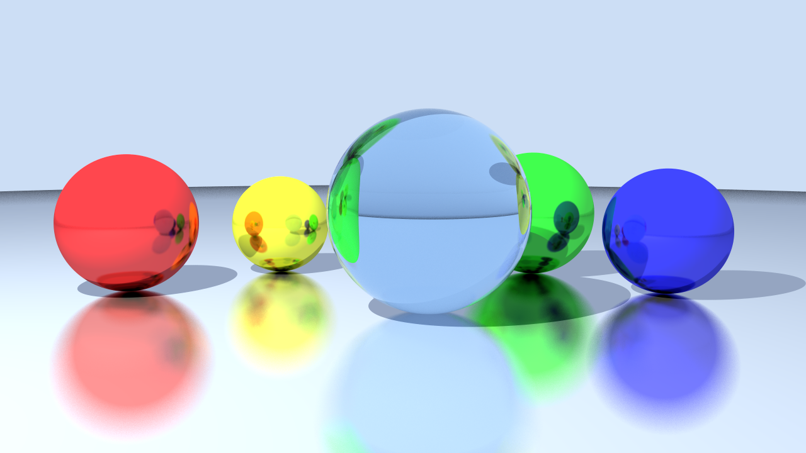

# Raytracing

A CPU ray tracer written in C++20, rendering spheres with reflective and refractive materials.



*1280x720, 400 samples per pixel.*

## Features

- **Materials**
  - Metal with adjustable roughness (fuzzy reflections)
  - Dielectric (glass): refraction, total internal reflection, Fresnel term with Schlick's approximation, tinted transmission
- **Lighting**: point lights with constant / linear / quadratic attenuation and hard shadows (shadow rays)
- **Antialiasing**: jittered supersampling
- **Camera**: look-at camera with configurable field of view
- **Display**: the image is drawn in an SDL3 window as it renders

## Building

Requires CMake 3.28+ and a C++20 compiler (tested with MSVC 2022 and GCC 13).
GLM and SDL3 are downloaded automatically with `FetchContent`.

```bash
cmake -S . -B build -DCMAKE_BUILD_TYPE=Release
cmake --build build --config Release
```

## Limitations

- Spheres are the only primitive
- No acceleration structure: every ray is tested against every object
- Single-threaded
- No gamma correction: colors are written as linear values

## Next steps

- Multithreaded rendering (rows split between threads, one random generator per thread)
- A BVH to speed up intersections
- More primitives (planes, triangles) and a Lambertian material
- Gamma correction and PNG export

## Credits

The material model is based on Peter Shirley's [Ray Tracing in One Weekend](https://raytracing.github.io/) series.
